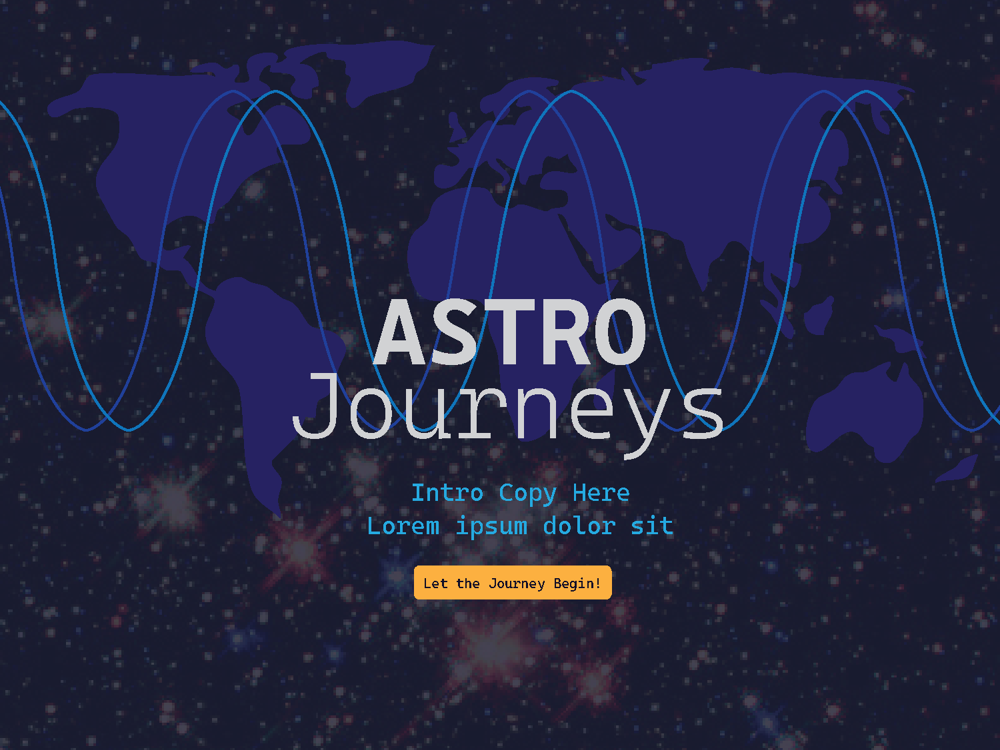
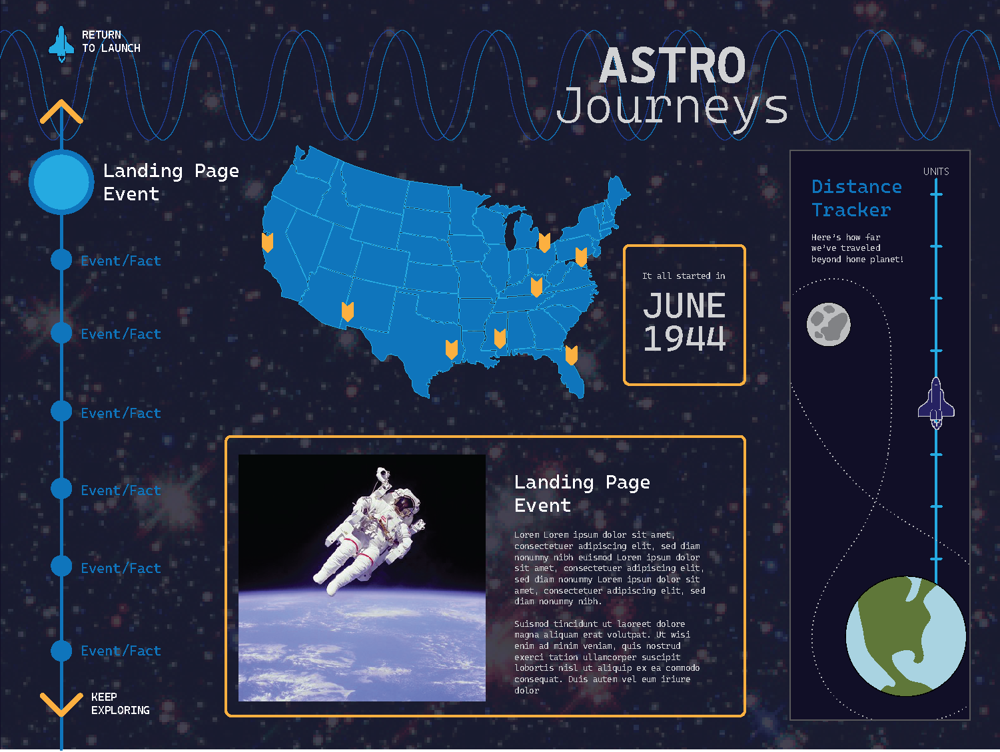
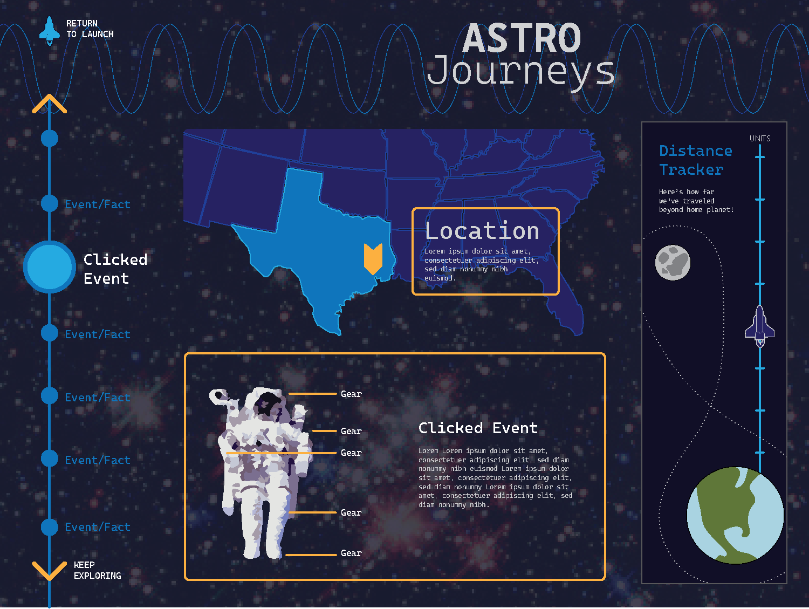

# Team Name - AstroJourneys!

# Geog575 Project Proposal:

## Group Members: 
- Katie Litchen
- Hope McBride
- Tiffany Jones
- Akhila Vattaluri Gangireddigari 

## Project Overview:
From the first manned space flights in the 1960s to the lunar ventures of future Artemis missions, watch a series of small steps turn into giant leaps for all mankind.

## User Persona: 
**Name & Position:** Oliver Armstrong is a fifth grader who lives just down the street from the Johnson Space Center in Houston, Texas. He dreams of being an astronaut one day and wants to learn more about NASA and the history of human spaceflight. His dad, a GIS analyst specializing in site selection, is helping him plan a trip to the Space Center Houston visitor center to gain **insight** through hands-on experiences. Oliver and his dad want to **identify** major historical events and locations pivotal to the history of space exploration. They want to understand how space travel has progressed over time. Oliver knows space is big, but he wants a visual aid to help him **compare** spaceflight distances. He wants to **identify** which mission took humanity furthest from Earth. Finally, Oliver’s dad knows Houston is important to NASA’s missions, but as a site selection analyst, he is curious about why Houston was chosen for a NASA center; he wants to draw **associations** and analyze **patterns** between important NASA locations to generate further **insight** into why NASA facilities are located where they are.

## User Case Scenarios:

**Scenario #1:** Upon arriving at the interactive exhibit, Oliver is greeted by a landing page with an entry point start button. Clicking the button activates an interactive window which features a timeline slider, a map view, a spaceflight-distance graphic, and a contextual information pane. As Oliver moves the slider from the first historical event to the next, he uses the dynamically growing spaceflight-distance graphic to **compare** and **rank** flight distances from Earth. Oliver moves the timeline to 1970 and notices a ‘Did You Know?’ button within the information pane. Tapping the button activates a popup informing him Apollo 13 took humans farthest away from Earth. Oliver is excited to learn this fun fact and wants to know more about the mission. He scrolls down to read all the text and view historical images in the information pane, which gives him context and helps him generate **insights** into the risks and rewards of being an astronaut. Oliver walks away from the exhibit even more excited to become an astronaut when he grows up. 

**Scenario #2:** Oliver’s dad arrives at the interactive after Oliver is done. The main interaction page is still active from when Oliver was exploring, so his dad selects the ‘Reset to Home’ button to return to the initial landing page. After clicking the start button, he scrolls through the historical timeline, paying close attention to how the map view and contextual information pane update dynamically for each event. As the timeline progresses, the map automatically zooms to and highlights the NASA center locations associated with each historical milestone. Oliver’s dad notices a **pattern** where many NASA centers are located in southern, coastal regions. By examining their proximity to water and considering rocket launch safety and debris risks, he draws **associations** and explores possible **correlations** between warm climates, nearby water access, rocket transportation logistics, and launch and safety considerations. These associations help him better understand how NASA selects sites for their space centers. 

## Requirements Document: 

| # | Representation | Description |
|---|-----------|-------------|
| 1 | Landing Page | Title/Home page with intro text and a launch button |
| 2 | Interface Event Page | Opens from the launch button and houses all subsequent elements alongside nav buttons to tab through events and a return button to return to the landing page |
| 3 | Timeline | Displays the year of the currently displayed event alongside the event name. Each node represents one event of interest |
| 4 | Historical Events | Each node on the timeline corresponds to an event of interest. Content of subsequent elements will refresh based on the current event, including a text description of what the event was, how it relates to the story, and some fun historical facts |
| 5 | Historical Images | Photos or other static visualizations relevant to specific events will be available throughout the journey |
| 6 | Basemap | Each timeline event will have an associated map representation focusing on key area(s) relevant to the event. The scale/extent will be fixed for each view |
| 7 | Event Locations | Markers on the basemap will indicate the points/locations of interest for each event. Pop-ups or labels may be included as needed to house more context for the event location |
| 8 | Flight Distances From Earth | Dynamic graphic depicting the extent of how far we have journeyed from Earth. Progresses with each event and may expand / re-scale as we send astronauts and satellites further in space on our journey |

### Interaction

| # | Interaction | Description |
|---|------------------|-------------|
| 1 | Timeline Manipulation | Sequence: Objects. Sequence through important dates on the timeline to trigger changes in the distance tracker, map view, and information window |
| 2 | Event Focus | Zoom/pan, automatically: Objects. The distance tracker and map view will adjust to the extent suited for the current event |
| 3 | Information Seeking | Retrieve: Objects. Click or brush objects noted on the distance tracker, map view, or within the event context to retrieve additional details |

## Wireframes: 

1. Landing Page:

2. Initial View:

3. User Selected View:

